```{r setup, include = FALSE}
options(htmltools.dir.version = FALSE)
library(knitr)
library(tidyverse)
library(xaringanExtra)
# set default options
opts_chunk$set(echo=FALSE,
               collapse = TRUE,
               fig.width = 7.252,
               fig.height = 4,
               dpi = 300)

# set engines
knitr::knit_engines$set("markdown")

xaringanExtra::use_tile_view()
xaringanExtra::use_panelset()
xaringanExtra::use_scribble()
xaringanExtra::use_share_again()
# Configuración de Python
# Sys.setenv(RETICULATE_PYTHON = "E:/Users/Josue/anaconda3/python.exe")
# Sys.setenv(RETICULATE_PYTHON = "C:/Users/Usuario/Anaconda3/python.exe")
# library(reticulate)

todo<-FALSE
```

# Objetivos del curso
<br><br>
- Comprender los conceptos fundamentales que rigen la Electrónica digital.
--

- Aprender a **diseñar** y **analizar** circuitos digitales:
  - Circuitos combinacionales.
  - Circuitos secuenciales.

--
- Conocer las caracteristicas generales de los microcontroladores (MCU)
  - Arquitectura 
  - Como programar un MCU<br><br>


---

# Introducción
## ¿Qué es la electrónica digital?
.pull-left[
Es el **análisis y diseño** de circuitos electrónicos que permiten llevar a cabo un o varias operaciones necesarias para completar una **decisión lógica**.

Se trabaja con señales digitales, i.e., señales que varían entre dos posibles estados: 1 y 0 (de hay su naturaleza ***binaria***).
]
--
Dentro de sus ventajas tenemos:
.font80[
.pull-right[

- Curva de aprendizaje rápida, diseños fáciles.
- Mayor precisión y posibilidad de programación.
- Se elimina el ruido entre los datos enviados.
    - Posibilidad de realizar copias exactas de datos, imágenes, música, etc.
    - Mejora considerablemente el traspaso de información desde dos medios de comunicación.
- Sus salidas por lo general son invariantes en el tiempo.
]]
---

# Análogo - Digital
<br>
```{r, out.width="120%"}
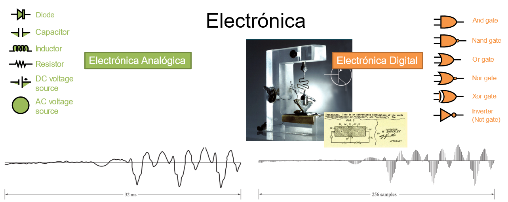
```
---
# Introducción - Linea de Tiempo
.panelset[.panel[.panel-name[1940]
```{r, out.width="70%", fig.align='center'}
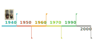
```
]
.panel[.panel-name[1950]
```{r, out.width="70%", fig.align='center'}
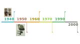
```
]
.panel[.panel-name[1960]
```{r, out.width="70%", fig.align='center'}
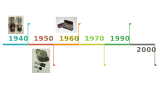
```
]
.panel[.panel-name[1970]
```{r, out.width="70%", fig.align='center'}
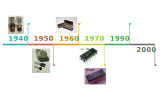
```
]
.panel[.panel-name[1990]
```{r, out.width="70%", fig.align='center'}
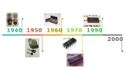
```
]
.panel[.panel-name[2000]
```{r, out.width="70%", fig.align='center'}
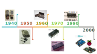
```
]]

???
1. **1940 :** Primer computador moderno construido mediante válvulas de vacío. De gran tamaño y bajo poder de computo. Exclusivo para universidades y militares por su coste, tamaño y complejidad de construcción.
2. **1950:** Surge el transistor, reduciendo el tamaño, pero no el conste de los computadores.
3. **1960:** El mayor apogeo de la electrónica digital ocurre con la creaciones de los circuitos integrados. Menos espacio: un bloque de 3x3mm equivale a 4-8 válvulas de vacío. La masificación de su construcción redujo costos y aplicaciones, permitiendo a los ingenieros optar a estos diseños, ampliando enormemente las aplicaciones.
4. **1970:**  Surge el primer microprocesador, el **Intel 4004** de 4 bits (1971). Al ser un microprocesador requería de otros circuitos para funcionar. En la misma década, la empresa Texas Instrument Fabrico el primer microcontrolador llamado **TMS1000 (1974).**
5. **1993:** Microchip crea el primer microcontrolador usando  **memorias EPPROM (PIC16x84) [4].** Atmel crea el primer MCU usando memoria Flash [5, 6].
6. **2000:**  Con el nuevo milenio un gran numero de proyectos han surgido (y surgen) **opensource**. Destacamos Arduino, una plataforma de desarrollo que ha facilitado enormemente el prototipado y automatización de sistemas, por su simpleza y bajo conste [7]. **Raspberry Pi** es un proyecto[8]
---


# Programa del Curso

.left-col[
### 1) Conceptos lógicos básicos
  - Señal digital
  - Niveles lógicos
  - Puertas lógicas y tablas de verdad
  
### 2) Sistemas numéricos
  - Sistena decimal
  - Sistema binario
  - Sistema Hexadécinal
  - Conversión ente sistemas
]

--

.center-col[
### 3) Lógica Combinacional
  - Funciones lógicas
  - Teoremas booleanos
  - Miniterminos y Maxiterminos
  - Mapas de Karnaugh
  - Aplicaciones Fundamentales
]

--

.right-col[
### 4) Lógica secuencial
  - Latch y Flipflops
  - Tablas de estados
  - Máquinas de estados finitas
  - Aplicaciones
]

---
# Programa del Curso
.pull-left[
<br>

### 5) Microcontroladores
  - Tipos de arquitectura 
  - Componentes internos
  - Memorias
  - Programación
  - Uso de Perfisféricos
]

--

.pull-right[
<br>
 
### 6) Otros temas
  - Osciladores
  - Multivibradores
  - Conversores AD y DA
  - Tipos de Memorias
]

--

---

# Softwares - Diseños digitales

A continuación se presentan una serie de programas que pueden ser utilizados para las simulaciones requeridas a lo largo del curso.

.panelset[.panel[.panel-name[logisim-evolution]
.pull-left[
- Software libre
- Recomendado para diseño de sistemas digitales. <br>
]
.pull-right[
```{r, fig.cap="Ejemplo de programa realizado en logisim-evolution", out.width="70%", fig.align='center'}
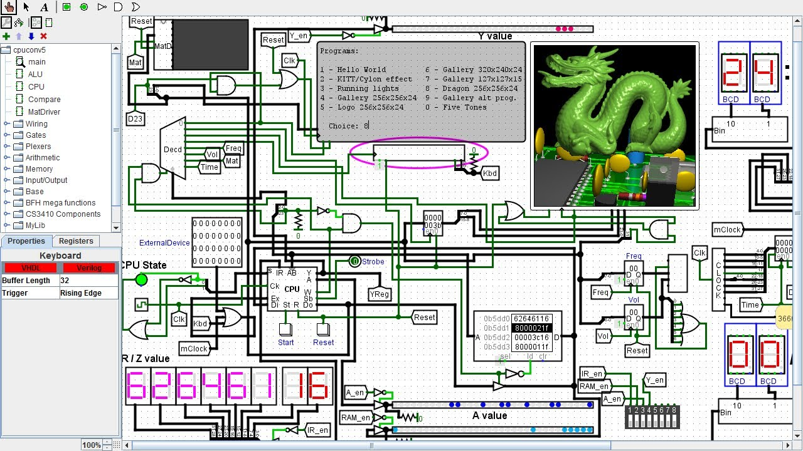

```

]
.center[[logisim-evolucion - Github](https://github.com/reds-heig/logisim-evolution)]]

.panel[.panel-name[LT-Spice]
.pull-left[
- Software gratuito, de la empresa Analog Devices
- Utiliza Spice
- Diferentes tipos de estudios: AC, DC, Transiente, Freq, etc.
- Simulación Analógica y digital. <br>]
.pull-right[
<br>
```{r, out.width="160%"}
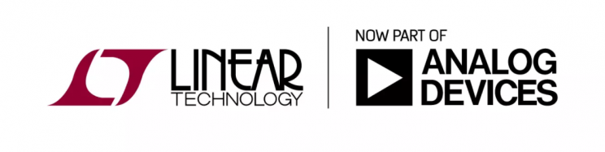
```
]
.center[[LT-Spice - Analog Devices](https://www.analog.com/en/design-center/design-tools-and-calculators/ltspice-simulator.html#)]]

.panel[.panel-name[SimulIde]
.pull-left[
- Software libre
- Permite simulación de:
  - Sistemas digitales
  - Microcontroladores <br>]
.pull-right[
```{r, }
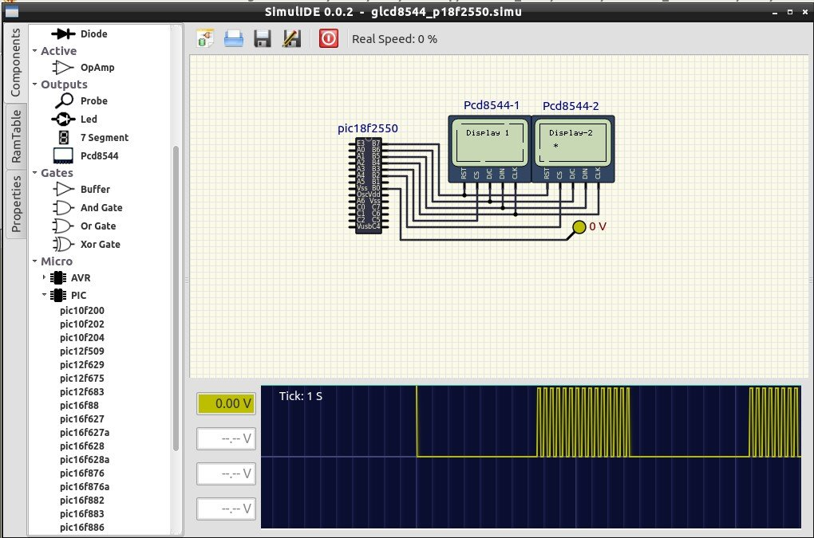
```
]

.center[  
[SimulIde - Official Page](https://www.simulide.com/p/downloads.html)
[SimulIde - Github](https://github.com/SimulIDE/SimulIDE)]]

.panel[.panel-name[Proteus]
.pull-left[
- Programa Propietario
- También basado en Spice
- Gran número de elementos digitales para simulación
- Permite diseño de PCB
- Posee simulación de Microcontroladores (MCU) <br>]
.pull-right[
```{r, fig.align='center', out.width="80%"}
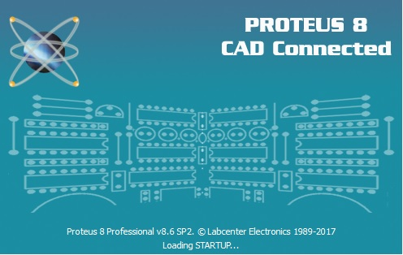
```
]
.center[[labcenter - Official Page](https://www.labcenter.com/)]]

.panel[.panel-name[Multisim]
.pull-left[
- Programa Propietario
- También basado en Spice
- Gran número de elementos digitales para simulación
- Permite diseño de PCB
- Posee simulación de Microcontroladores (MCU) <br>]
.pull-right[
```{r, fig.align='center', out.width="80%"}
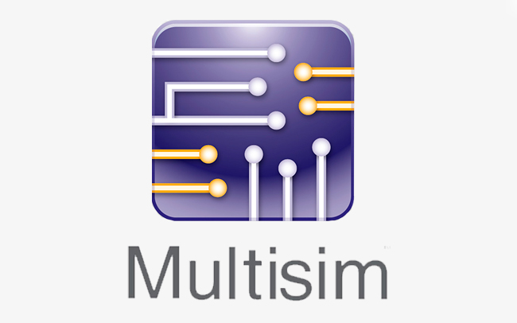
```
]
.center[[National Instrument - Official Page](https://www.ni.com/en-us/support/downloads/software-products/download.multisim.html)]]
]
---
# Softwares - Microcontroladores
.panelset[
.panel[.panel-name[MPLAB]
.pull-left[
- Gratuito, de la empresea Microchip
- Permite programar y grabar en los microcontroladores PIC
- Permite programar en Ensamblador y C (mod)
]
.pull-right[
```{r, fig.align='center', out.width="40%"}
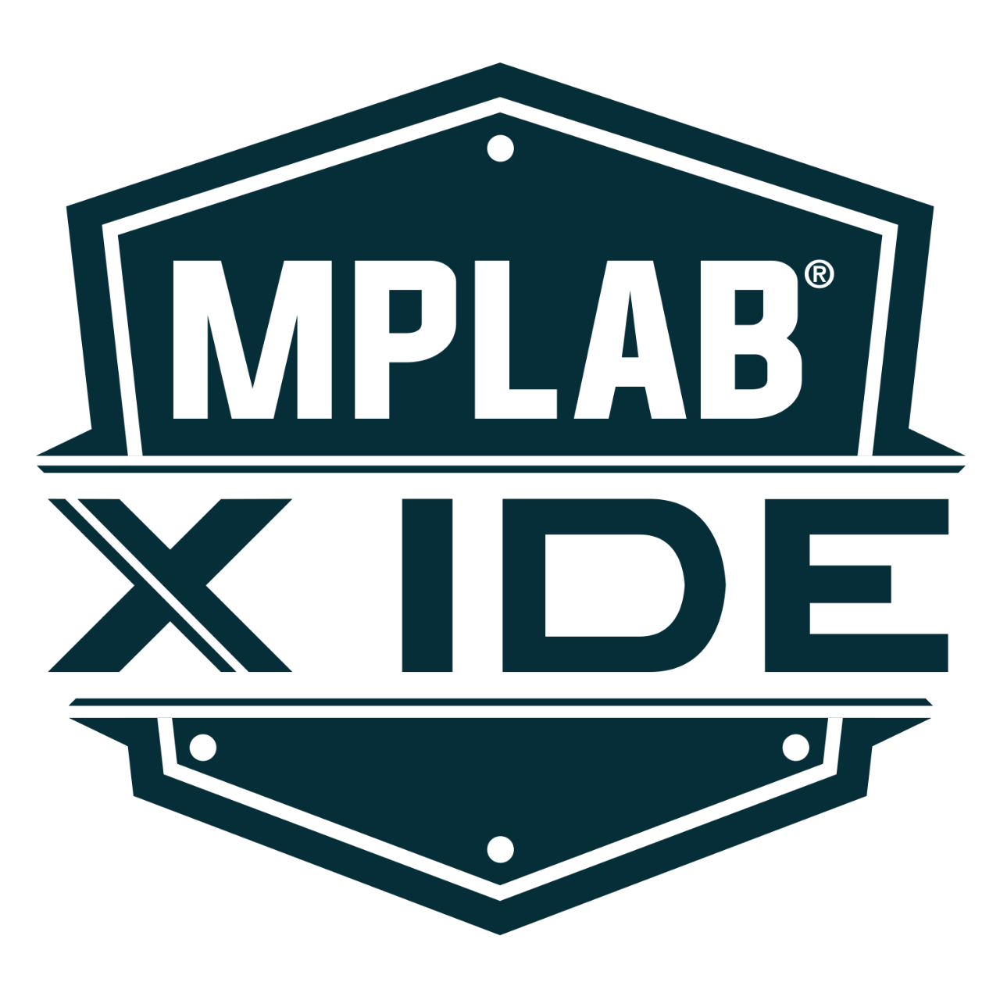
```
]
.center[[MPLAB IDE - Official Page](https://www.ni.com/en-us/support/downloads/software-products/download.multisim.html)]
.center[[MPLAB XC8](https://www.microchip.com/en-us/development-tools-tools-and-software/mplab-xc-compilers)]
]

.panel[.panel-name[Arduino]
.pull-left[
- Programa opensource (código abierto y gratuito)
- Plantaforma de desarrollo para los microcontroladores ATmega y Cortex (firmware modificado)
- Permite programar en C/C++ (mod, lenguaje Arduino)
]

.pull-right[
```{r, fig.align='center', out.width="40%"}
knitr::include_graphics("./images/Arduino_logo.png")
```
]
.center[[Arduino - Official Page](https://www.arduino.cc/)]]
]

---
# Evaluación 
.panelset[.panel[.panel-name[Antiguamente]
.font120[
- Informes de laboratorios (70%) 
- Proyecto final (30%)
]]

.panel[.panel-name[Actual (Pandemia)]
.font120[
- **Nuevo** Laboratorios Asíncronos (30%)
- Simulaciones por tema (50%)
- Presentación final (20%)
]]]

---

# Plataforma Moodle

```{r, fig.align='center', out.width="100%"}
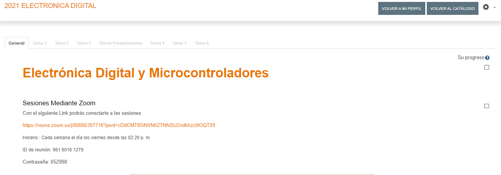
```
.center[
[Link Plataforma del curso](https://uvirtual.usach.cl/moodle/course/view.php?id=17661)]
---
# Laboratorios Remotos asíncronos
.pull-left[
## Arduino
- Plataforma de desarrollo de código libre
- Programado en C/C++ (mod)
  - "Lenguaje Arduino"
- Prototipado Modular
- Por ahora lo usaremos como una **caja negra**

```{r, fig.align='center', out.width="50%"}
knitr::include_graphics("./images/Arduino-Uno.png")
```
]
--

.pull-right[
## Raspberry Pi
- Son una serie de mini-computadores que funcionan sobre **GNU Linux**
- Poseen comunicación con el exterior mediante GPIO

## Anydesk
- Programa Propietarios, gratuito para uso personal
- Multiplataforma
- VNC
.center[
[Página oficial - AnyDeks](https://anydesk.com/es/downloads)
]]

---

# Laboratorios Remotos asíncronos - Flujo de trabajo
<br><br>
```{r , fig.align='center', out.width="80%"}
```

--
<br>
```{r, fig.align='center', out.width="25%"}
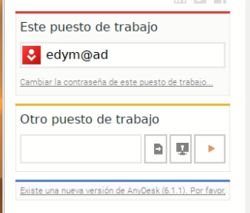
```
.center[pass: electro2021]

---
# Bibliografía
```{r, load_refs, echo=FALSE, results='hide', warning=FALSE, message=FALSE}
library(RefManageR)
bib <- ReadBib("./bibliography.bib", check = FALSE)
ui <- "- "
element <- list(check.entries = FALSE, 
               style = "html", 
               bib.style = "authoryear") 

print_ref <- function(ref){
  writeLines(ui)
  print(bib[key = ref], .opts = element, encoding = "UTF-8")
}
```


.font80[

```{r, print_refs, echo=FALSE, results='asis', warning=FALSE, message=FALSE}

print_ref("horowitz2015")
print_ref("bignell1997")
print_ref("mano2003")
print_ref("mano2017")
print_ref("karris2007")
print_ref("angulousategui2003")
print_ref("schilling1993")
print_ref("floyd2006")
print_ref("logisim-evolution2020")
print_ref("LTspiceDesignCenter")

```
]

