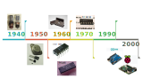

```{css echo=FALSE}
.red{
  opacity: 0.5;
  color:red;
}
.fs-m{
  font-size: 120%;
  
}
.big{
  font-size: 150%;
}

.center2 {
  margin: 0;
  position: absolute;
  top: 50%;
  left: 10%;
  -ms-transform: translate(-50%, -50%);
  transform: translate(-50%, -50%);
}

```

```{r setup, include = FALSE}
options(htmltools.dir.version = FALSE)
library(knitr)
library(tidyverse)
library(xaringanExtra)
library(nhsrtheme)
library(NHSRdatasets)
# set default options
opts_chunk$set(echo=FALSE,
               collapse = TRUE,
               fig.width = 7.252,
               fig.height = 4,
               dpi = 300)

# set engines
knitr::knit_engines$set("markdown")

xaringanExtra::use_tile_view()
xaringanExtra::use_panelset()
xaringanExtra::use_scribble()

# Configuración de Python
Sys.setenv(RETICULATE_PYTHON = "E:/Users/Josue/anaconda3/python.exe")
library(reticulate)

todo<-FALSE
```

```{python config, echo=FALSE}
import matplotlib.pyplot as plt
import matplotlib
import numpy as np

matplotlib.use('Agg')
```

# Objetivos del curso
<br><br>
- Comprender los conceptos fundamentales que rigen la Electrónica digital.
--

- Aprender a **diseñar** y **analizar** circuitos digitales:
  - Diseño de circuitos combinacionales.
  - Diseño de circuitos secuenciales.

--
- Conocer las caracteristicas generales de los microcontroladores (MCU)
  - Arquitectura 
  - Como programar un MCU<br><br>


---

# Introducción
## ¿Qué es la electrónica digital?
.pull-left[
Es el **análisis y diseño** de circuitos electrónicos que permiten llevar a cabo un o varias operaciones necesarias para completar una **decisión lógica**.

Se trabaja con señales digitales, i.e., señales que varían entre dos posibles estados: 1 y 0 (de hay su naturaleza ***binaria***).
]
--
Dentro de sus ventajas tenemos:
.font80[
.pull-right[

- Curva de aprendizaje rápida, diseños fáciles.
- Mayor precisión y posibilidad de programación.
- Se elimina el ruido entre los datos enviados.
    - Posibilidad de realizar copias exactas de datos, imágenes, música, etc.
    - Mejora considerablemente el traspaso de información desde dos medios de comunicación.
- Sus salidas por lo general son invariantes en el tiempo.
]]

---
# Introducción - Linea de Tiempo

```{r, fig.align='center', out.height="80%"}

```

---
<!-- # Motivación -->
<!-- ## Fundamentos -->
<!-- ```{python analogic-signal, echo=FALSE, results='hide'} -->
<!-- from scipy import signal -->
<!-- import matplotlib.pyplot as plt -->

<!-- import numpy as np -->

<!-- t = np.linspace(0, 1, 500, endpoint=False) -->

<!-- cm = 1/2.54 -->
<!-- fig, ax = plt.subplots(1, 2, figsize=(30*cm, 10*cm)) -->

<!-- # Señal ideal -->
<!-- signal =  np.sin(2 * np.pi * 5 * t) -->
<!-- ax[0].plot(t, signal, color="black") -->
<!-- ax[0].set_title("(a)") -->
<!-- ax[0].set_ylabel("Voltaje (V)"); ax[0].set_xlabel("Tiempo (s)") -->

<!-- # Señal con ruido -->
<!-- noise = np.random.normal(0, 0.1, signal.shape) -->
<!-- ax[1].plot(t,  signal+noise , color="black") -->
<!-- ax[1].set_title("(b)") -->
<!-- ax[1].set_xlabel("Tiempo (s)") -->


<!-- plt.xlabel("Tiempo (s)") -->
<!-- plt.show() -->
<!-- ``` -->

<!-- `r n_fig<-1` .center[**Fig.`r n_fig` ** Señal digital cuadrada, utilizada en generalmente en los sistemas digitales.(a) Señal ideal transmitida (b) Señal real con ruido.] -->

<!-- --- -->

<!-- # Motivación -->
<!-- ## Fundamentos -->
<!-- ```{python logic-signal, echo=FALSE, results='hide', fig.show=TRUE} -->
<!-- #!/usr/bin/env python -->
<!-- # -*- coding: utf-8 -*- -->

<!-- import matplotlib.pyplot as plt -->
<!-- import matplotlib -->
<!-- import numpy as np -->

<!-- matplotlib.use('Agg') -->

<!-- from scipy import signal -->

<!-- t            = np.linspace(0, 1, 500, endpoint=False) -->
<!-- logic_signal = 0.5+0.5*signal.square(2 * np.pi * 5 * t)   -->
<!-- noise        = np.random.normal(0, 0.05, logic_signal.shape) -->

<!-- cm = 1/2.54 -->
<!-- fig, ax = plt.subplots(1, 2, figsize=(30*cm, 10*cm)) -->

<!-- title = ["(a)", "(b)"] -->
<!-- data = [logic_signal, logic_signal+noise] -->

<!-- for i in [0, 1]: -->
<!--   ax[i].plot(t, data[i], color="black") -->
<!--   ax[i].set_xlabel(r"Tiempo (s)") -->
<!--   ax[i].set_title(title[i]) -->

<!-- ax[0].set_ylabel(r"Nivel logico") -->

<!-- plt.show() -->
<!-- ``` -->
<!-- `r  n_fig<-n_fig+1` -->

<!-- .center[**Fig.`r n_fig`** Señal digital. (a) Señal digital ideal. (b) Señal digital con ruido.] -->

<!-- --- -->

# Programa del Curso

.left-col[
### 1) Conceptos lógicos básicos
  - Señal digital
  - Niveles lógicos
  - Puertas lógicas y tablas de verdad
  
### 2) Sistemas numéricos
  - Sistena decimal
  - Sistema binario
  - Sistema Hexadécinal
  - Conversión ente sistemas
]

--

.center-col[
### 3) Lógica Combinacional
  - Funciones lógicas
  - Teoremas booleanos
  - Miniterminos y Maxiterminos
  - Mapas de Karnaugh
  - Aplicaciones Fundamentales
]

--

.right-col[
### 4) Lógica secuencial
  - Latch y Flipflops
  - Tablas de estados
  - Máquinas de estados finitas
  - Aplicaciones
]

--
---
# Programa del Curso
.pull-left[
<br>

### 5) Microcontroladores
  - Tipos de arquitectura 
  - Componentes internos
  - Memorias
  - Programación
  - Uso de Perfisféricos
]

--

.pull-right[
<br>
 
### 6) Otros temas
  - Osciladores
  - Multivibradores
  - Conversores AD y DA
  - Tipos de Memorias
]

--

---

# Evaluación 
.panelset[.panel[.panel-name[Antiguamente]
.font120[
- Informes de laboratorios (70%) 
- Proyecto final (30%)
]]

.panel[.panel-name[Actual (Pandemia)]
.font120[
- **Nuevo** Laboratorios Asíncronos (30%)
- Simulaciones por tema (50%)
- Presentación final (20%)
]]]

---

# Softwares

A continuación se presentan una serie de programas que pueden ser utilizados para las simulaciones requeridas a lo largo del curso.

.panelset[.panel[.panel-name[logisim-evolution]
- Software libre :
- Recomendado para diseño de sistemas digitales. <br>

.center[[logisim-evolucion - Github](https://github.com/reds-heig/logisim-evolution)]]

.panel[.panel-name[LT-Spice]
- Software gratuito, de la empresa AnalogDevice
- Utiliza PSpice
- Diferentes tipos de estudios: AC, DC, Transiente, Freq, etc.
- Simulación Analógica y digital. <br>
.center[[LT-Spice - Analog Devices](https://www.analog.com/en/design-center/design-tools-and-calculators/ltspice-simulator.html#)]]

.panel[.panel-name[SimuIde]
- Software libre
- Permite simulación de:
  - Sistemas digitales
  - Microcontroladores <br>
.center[  
[SimulIde - Official Page](https://www.simulide.com/p/downloads.html)
[SimulIde - Github](https://github.com/SimulIDE/SimulIDE)]]

.panel[.panel-name[Proteus]
- Programa Propietario
- También basado en PSpice
- Gran número de elementos digitales para simulación
- Permite diseño de PCB
- Posee simulación de Microcontroladores (MCU) <br>
.center[[labcenter - Official Page](https://www.labcenter.com/)]]

.panel[.panel-name[Multisim]
- Programa Propietario
- También basado en PSpice
- Gran número de elementos digitales para simulación
- Permite diseño de PCB
- Posee simulación de Microcontroladores (MCU) <br>
.center[[National Instrument - Official Page](https://www.ni.com/en-us/support/downloads/software-products/download.multisim.html)]]

]


---

# Bibliografía
```{r, load_refs, echo=FALSE, results='hide', warning=FALSE, message=FALSE}
library(RefManageR)
bib <- ReadBib("./bibliography.bib", check = FALSE)
ui <- "- "
element <- list(check.entries = FALSE, 
               style = "html", 
               bib.style = "authoryear") 

print_ref <- function(ref){
  writeLines(ui)
  print(bib[key = ref], .opts = element, encoding = "UTF-8")
}
```


.font80[

```{r, print_refs, echo=FALSE, results='asis', warning=FALSE, message=FALSE}

print_ref("horowitz2015")
print_ref("bignell1997")
print_ref("mano2003")
print_ref("mano2017")
print_ref("karris2007")
print_ref("angulousategui2003")
print_ref("schilling1993")
print_ref("floyd2006")
print_ref("logisim-evolution2020")
print_ref("LTspiceDesignCenter")

```
]

