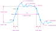

```{r, code = readLines("config.R"), include = FALSE}
```

# Objetivos
.pull-left[
## Teoría
- Introducir algunos conceptos básicos utilizados en electrónica digital:
  - Niveles Lógicos
  - Lógica positiva y negativa
  - Señal lógica
- Estudiar aplicaciones de estos conceptos:
  - Código ASCII
  - Comunicación serial Asíncrona (UART)
]

--
.pull-right[
## Laboratorio
- Introducción a la plataforma Arduino
- Comunicarnos con Arduino mediante comunicación serial
  - Ejemplos
  
<br>
.bg-washed-green.b--dark-green.ba.bw2.br4.ph2.font80[
- Instalen [**IDE Arduino**](https://www.arduino.cc/en/software) y [**SimulIde**](https://www.simulide.com/p/downloads.html)
]
]

---

# Niveles Lógicos

.left-column[ 
## Alto
- 1 (uno lógico)
- Verdadero
- +5V (+3.3V)
- Alto o HIGH

## Bajo
- 0 (cero lógico)
- Falso
- GND
- Bajo o LOW
]
--
.right-column[ 
.panelset[
.panel[.panel-name[Rangos]
```{r, fig.cap="Logic level ranges of voltage for a digital circuit. Digital Fundamental - T. Floyd", out.width="30%", fig.align='center'}

```
]
.panel[.panel-name[Tipos de lógica]
<br><br>
```{r, fig.cap="Niveles Lógicos. Tipos de lógicaDigital Fundamental - T. Floyd", out.width="100%", fig.align='center'}

```
]]
]
???
- En electrónica siempre trabajaremos con dos niveles lógicos (de aquí su naturaleza binaria). Podemos asignarle diversos nombres a cada uno de estos niveles: **1, Verdatero o True, Alto o High**
  - Bit : **bi**nary digi**t**
  - byte: 8 bits
- Tenemos dos tipos de lógicas: 
  - **lógica positiva**: 1: high, 0: Low (usada en el curso)
  - **lógica negativa**: 1: Low, 0: High
---


# Señal Digital 
.left-colum[
.bg-washed-green.b--dark-green.ba.bw2.br4.ph2.font80[
**Señal Digital:** Señal de tipo discreta, variante en el tiempo, compuesta por una serie de *pulsos lógicos* (cambios entre 0 y 1) utilizadas en circuitos digitales.
]]

--
.right-colum[
.panelset[
.panel[.panel-name[Señal periódica/no periódica]
<br>
```{r , fig.align='center', out.width="100%", fig.cap="Pulso lógico no ideal. (Fundamental - T. Floyd)"}

```
]

.panel[.panel-name[Señal no-ideal]
```{r , fig.align='center', out.width="50%", fig.cap="Pulso lógico no ideal. (Fundamental - T. Floyd)"}

```
]

.panel[.panel-name[Señal no-ideal 2]
```{r, out.width="60%", fig.cap="Pulso lógico no ideal. (Fundamental - T. Floyd)"}

```
]
]]

???
- La señal puede ser periódica (también conocida como **señal de reloj** *clk*)
- o puede ser no-periodica (pulso de encendido, por ejemplo)
- Tiene un tiempo tanto de subida como bajada
  - Los tramos de subida son llamados **flanco de subida**
  - Los tramos de bajada son llamados **flanco de bajada**
- **Droop**: inclinarse, caer
---

# Aplicación 1 - Código ASCII
.bg-washed-green.b--dark-green.ba.bw2.br4.ph2.font80[
**ASCII : ** **A**merican **S**tandard Code for **I**nformation **I**nterchange
]

Sirve para describir:
- letras imprimibles 
- números, 
- signos de puntuación 
- códigos de control

Esta compuesto por 7 pulsos digitales + 1 de verificación. 
---
class: clear

```{r}
knitr::include_url("https://www.rapidtables.com/code/text/ascii-table.html", height = "650px")
```

---

# Aplicación 2 - Comunicación Serial Asíncrona
.center[UART -> **universally asynchronous receiver/transmitter**]
.pull-left[
```{r , fig.align='center'}

```
]
--

.pull-right[## Ventajas
- Es una de las más simple 
  - Ampliamente utilizada en instrumentos
- Permite enviar señales de larga distancia
- Utiliza el mínimo de conexiones

## Desventajas
- Lenta transferencia de datos
]


---

# Aplicación 2 - Comunicación Serial Asíncrona
.panelset[
.panel[.panel-name[Tx/Rx]
<br><br>
```{r, out.width="50%"}


```
]
.panel[.panel-name[Tipos]
<br><br>
```{r,out.width="90%"}

```
]
.panel[.panel-name[Síncrono-asíncrono]
<br><br>
```{r,out.width="90%"}


```

]
]
???
- **Universal** Por que es un standar
- **asynchronous** Porque la comunicación no utiliza un reloj digital (pulsos continuos)
- **receiver/transmitter** Existe un receptor y emisor.

---


# Ejemplo 1: ASCII + Serial
Encontrar la letra enviada

<br>
```{r , fig.align='center', out.width="80%"}

```
<br>
```{r}
knitr::include_url("https://www.rapidtables.com/code/text/ascii-table.html", height = "200px")
```
---
# Ejemplo 2: ASCII + Serial
Enviar la letra T mediante código ASCII

<br>
```{r , fig.align='center', out.width="80%"}
knitr::include_graphics("./images/02/ejemplo_serial_A2.svg")
```

<br>
```{r}
knitr::include_url("https://www.rapidtables.com/code/text/ascii-table.html", height = "200px")
```
---

# Bibliografía
.font100[
- Sección 1.1-1.2 (CONCEPTOS DIGITALES). Floyd, Thomas L. 2006. Fundamentos de Sistemas Digitales. Prentice Hall.

- CHAPTER 10 - DIGITAL LOGIC, 10.1 Basic logic concepts. Horowitz, Paul, and Winfield Hill. 2015. The Art of Electronics. Cambridge Univ. Press.

- 9.7 Código ASCII. Bignell, James W., Robert L. Donovan, and Gerardo Urbina Medel. 1997. Electrónica Digital.

- Fischer, Eric. 2012. “The Evolution of Character Codes, 1874-1968.” Citeseerx. Ist.

]

---
layout: false
class: inverse, middle, center
#[**Lab 1:** Comunicación Serial](https://josuem.github.io/slides_EDyM/LAB1_Intro_Arduino_UART.html)
--

**Próxima clase:** Sistemas numéricos


