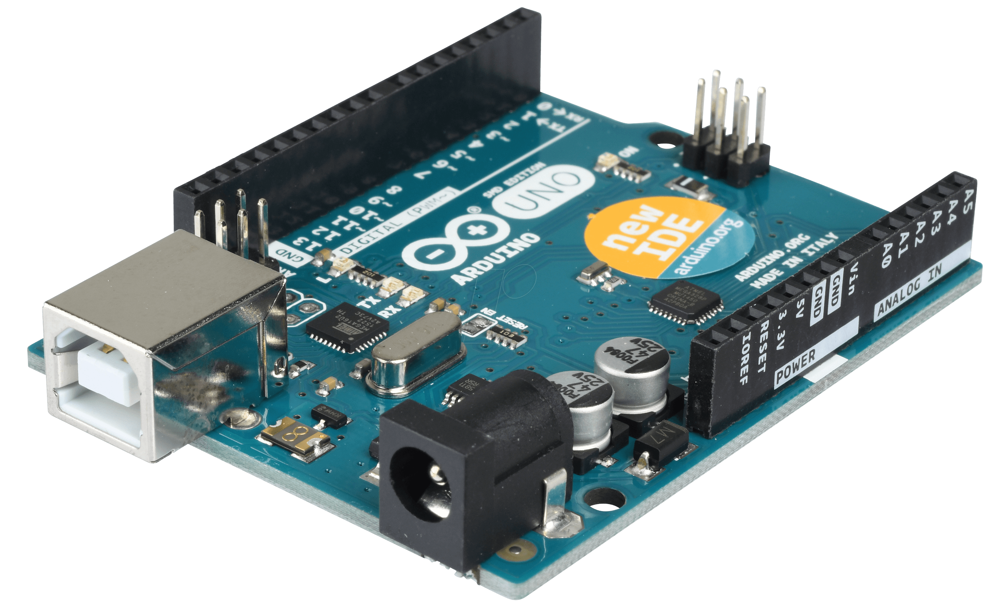

```{r setup, include = FALSE}
options(htmltools.dir.version = FALSE)
library(knitr)
library(tidyverse)
library(xaringanExtra)
library(icons)
# set default options
opts_chunk$set(echo=FALSE,
               collapse = TRUE,
               fig.width = 7.252,
               fig.height = 4,
               dpi = 300)

knitr::opts_chunk$set(echo = FALSE, 
                      fig.align = "center",
                      dev = "svg")
# set engines
knitr::knit_engines$set("markdown")

xaringanExtra::use_tile_view()
xaringanExtra::use_panelset()
xaringanExtra::use_scribble()
xaringanExtra::use_tachyons()
xaringanExtra::use_clipboard()

xaringanExtra::use_extra_styles(
  hover_code_line = TRUE,         #<<
  mute_unhighlighted_code = TRUE  #<<
)

todo<-FALSE
```

# Arduino
.pull-left[
- El ambiente Arduino es realmente C++, con bibliotecas de soporte, y además asume algunos parámetros relativos al microcontrolador, para simplificar el proceso de programación [[1]](https://arduino.cl/introduccion-a-los-tipos-de-dato-con-arduino/).

- Plataforma de desarrollo que permite cargar programas para realizar tareas especificas:
  - Automatización y control
  - Medición
  - Protopitado
  - etc.
  - .red[What more?]
]  
.pull-right[
.pull-left[
<br><br><br><br>
```{r , out.width="100%", fig.cap=""}
knitr::include_graphics("./images/02/Arduino_logo.png")
```
]
<br><br><br><br>
.pull-right[
```{r , out.width="100%", fig.cap=""}

```
]
<br><br><br><br>

`r icon_style(fontawesome("link", style = "solid"), scale=1, fill="#8fd8be")` [Pagina oficial Arduino](https://www.arduino.cc/)
]  


???
- Plataforma de desarrollo: posee todo lo necesario para implementar un MCU.
---

# Estructura básica
.pull-left[
```{arduino, eval=FALSE, echo=TRUE}
void setup() { #<<
  // put your setup code here

}

void loop() { #<<
  /* put your main code here, 
  to run repeatedly:*/

}
```
]
.pull-right[
- `void setup(){}`: Código de configuración. Ejecutado una sola vez.
- `void loop()[]` : Loop principal. Se repite infinitamente!!!.
- `\\`: Es utilizado para comentarios de una linea. 
  - `\*  *\`  para comentarios multi-linea.
]

--

En realidad estas dos partes no son más que dos funciones
.center[
```{arduino, eval=FALSE, echo=TRUE}
tipo nombre_funcion(variables){}
void          setup()         {}
void           main()         {}

```
]
---

# Variables
.font120[
- Siempre tienen que ser declara, especificando, aunque sea una vez, su tipo.

- Cada linea tiene que terminar en `;` (salvo las funciones).
]

--
```{arduino, eval=FALSE, echo=TRUE}
int x;      // Variable `x` declarada
int n = 0;  // Variable `n` declarada y asignada 
```

---
# Tipos de variables

```{arduino, eval=FALSE, echo=TRUE}
void          // The void keyword is used only in function declarations. It indicates that the function is expected to return no information
byte          // A byte stores an 8-bits unsigned number, from 0 to 255 (2^8-1).
int           // 16-bits (2-byte).  Range of -32,768 to 32,767 (-2^15, 0, 2^15-1).
unsigned int  // 0 to 65,535 ((2^16) - 1).
long          // 32-bits (4 bytes), from -2,147,483,648 to 2,147,483,647.
unsigned long // 0 to 4,294,967,295 (2^32 - 1).
float         // -3.4028235E+38 to 3.4028235E+38 . They are stored as 32 bits (4 bytes).
double        // Idem. to float on Arduino Uno. On Arduino Due, 8-byte (64 bit) precision.

char          // A data type used to store a character value.
char myChar = 'A';

String        
String stringOne = "Hello String"; 
```


.center[[Variable Declaration - Arduino.cc](https://www.arduino.cc/en/Reference/VariableDeclaration)]
???
- Entonces ustedes se preguntan ahora **¿Qué variables puedo utilizar?
- Si en sus cursos de programación se preguntaron para que necesitamos saber tantos tipos de variables. Bueno en los MCU son muy importantes porque el espacio del programa tiene que ser óptimo.
---

# Condicional If else
La instrucción if busca una condición y ejecuta la siguiente instrucción o conjunto de declaraciones si la condición es 'verdadera'.

.pull-left[
### sintáxis
```{arduino, eval=FALSE, echo=TRUE}
if (condition) {
  //statement(s)
}
```

```{arduino, eval=FALSE, echo=TRUE}
x == y (x is equal to y)
x != y (x is not equal to y)
x <  y (x is less than y)
x >  y (x is greater than y)
x <= y (x is less than or equal to y)
x >= y (x is greater than or equal to y)
```
]
.pull-right[
```{arduino, eval=FALSE, echo=TRUE}
if (condition1) {
  // do Thing A
}
else if (condition2) {
  // do Thing B
}
else {
  // do Thing C
}
```
]
.center[
`r icon_style(fontawesome("link", style = "solid"), scale=1, fill="#8fd8be")` [If - Arduino](https://www.arduino.cc/reference/en/language/structure/control-structure/if/)
`r icon_style(fontawesome("link", style = "solid"), scale=1, fill="#8fd8be")` [else - Arduino](https://www.arduino.cc/reference/en/language/structure/control-structure/else/)

]
---

# Ciclo while
Un ciclo while se repetirá de forma continua e infinita, hasta que la expresión dentro del paréntesis () se vuelva falsa. 
.pull-left[
### sintáxis

```{arduino, eval=FALSE, echo=TRUE}
while (condition) {
  // statement(s)
}
```
]
.pull-right[
### Ejemplo
```{arduino, eval=FALSE, echo=TRUE}
var = 0;
while (var < 200) {
  // do something repetitive 200 times
  var++;
}
```
]

.center[
`r icon_style(fontawesome("link", style = "solid"), scale=1, fill="#8fd8be")` [while - Arduino](https://www.arduino.cc/reference/en/language/structure/control-structure/while/)
]

---
# Ciclo For
La instrucción for se usa para repetir un bloque de declaraciones entre llaves. Por lo general, se usa un contador de incrementos.

.pull-left[
### sintáxis
```{arduino, eval=FALSE, echo=TRUE}
for (initialization; condition; increment) {
  // statement(s);
}
```
]
.pull-right[
### Ejemplo
```{arduino, eval=FALSE, echo=TRUE}
for (int i = 0; i <= 255; i++) {
  delay(10);
}
```
]

.center[
`r icon_style(fontawesome("link", style = "solid"), scale=1, fill="#8fd8be")` [for - Arduino](https://www.arduino.cc/reference/en/language/structure/control-structure/for/)

]
---

# Funciones especiales - delay()
Pausa el programa durante el tiempo (en milisegundos) especificado como parámetro. 


### Sintáxis
```{arduino, eval=FALSE, echo=TRUE}
delay(ms) // = ms*delayMicroseconds()
```
.center[
`r icon_style(fontawesome("link", style = "solid"), scale=1, fill="#8fd8be")` [delay()](https://www.arduino.cc/reference/en/language/functions/time/delay/)
]
---

# Funciones especiales - Serial
Se utiliza para la comunicación entre la placa Arduino y una computadora u otros dispositivos. 
Todas las placas Arduino tienen al menos un puerto serie.

### Sintaxis begin
Serial.begin(speed) // en baudios o bit/s
```{arduino, eval=FALSE, echo=TRUE}
void setup() {
    Serial.begin(9600); // opens serial port, sets data rate to 9600 bps
}

void loop() {
  
}
```
---
### Sintáxis flush
Espera a que se complete la transmisión de datos en serie salientes
```{arduino, eval=FALSE, echo=TRUE}
Serial.flush()
```

### Sintáxis print/println
**`print`**: Imprime datos en el puerto serie como texto ASCII legible por humanos. 
**`println`**: Idem. pero al final envía un ENTER (ASCII 13, o '\r').

```{arduino, eval=FALSE, echo=TRUE}
Serial.print()
Serial.println()
```
#### Ejemplo
```{arduino, eval=FALSE, echo=TRUE}
void setup() {
  Serial.begin(9600);
}

void loop() {
  Serial.println("Hola mundo");
  delay(10);
}
```


[Serial - Arduino](https://www.arduino.cc/reference/en/language/functions/communication/serial/)

[Serial.begin()](https://www.arduino.cc/reference/en/language/functions/communication/serial/begin/)

---

# Ejemplo 1 - Reloj simple
Escribir un código que permita enviar por serial un valor de tiempo cada segundo.


```{r , fig.cap=""}

```
.center[.font120[10 min para realizarlo ]]
---

# Funciones especiales - Serial 2
### Syntáxis available
Verifica si se encuentra disponibles el el buffer del puerto para ser leídos. 

```{arduino, eval=FALSE, echo=TRUE}
Serial.available()
```

#### Ejemplo
```{arduino, eval=FALSE, echo=TRUE}
void setup() {
  Serial.begin(9600); 
}

void loop() {
  // reply only when you receive data:
  if (Serial.available() > 0) {
    // read the incoming byte:
    incomingByte = Serial.read();

    // say what you got:
    Serial.print("I received: ");
    Serial.println(incomingByte, DEC); //
  }
}
```

### Sintáxis read
Lee datos seriales entrantes. Los datos son leídos con el número ASCII de la entrada.
```{arduino, eval=FALSE, echo=TRUE}
Serial.read()
```
### Sintáxis readString()
Lee datos seriales entrantes directamente como String. 

#### Ejemplo
```{arduino, eval=FALSE, echo=TRUE}
void setup() {
  Serial.begin(9600);
}

void loop() {
  if (Serial.available() > 0) {
    Serial.println( Serial.readString());
    Serial.print("Enviaste: ");
  }
}
```


---

# Ejemplo 2 - Preguntar nombre
Escribir un código que pregunte tu nombre y lo devuelva
```{r , out.width="55%", fig.cap=""}

```


---
# Tarea 1
- Realizar un "reloj digital" utilizando comunicación serial, donde el usuario pueda cambiar el tiempo mostrado en consola.
--
Enviar:
- Diagrama de flujo del programa.
- Código .ino final.
---

